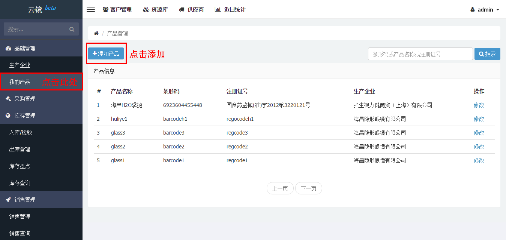
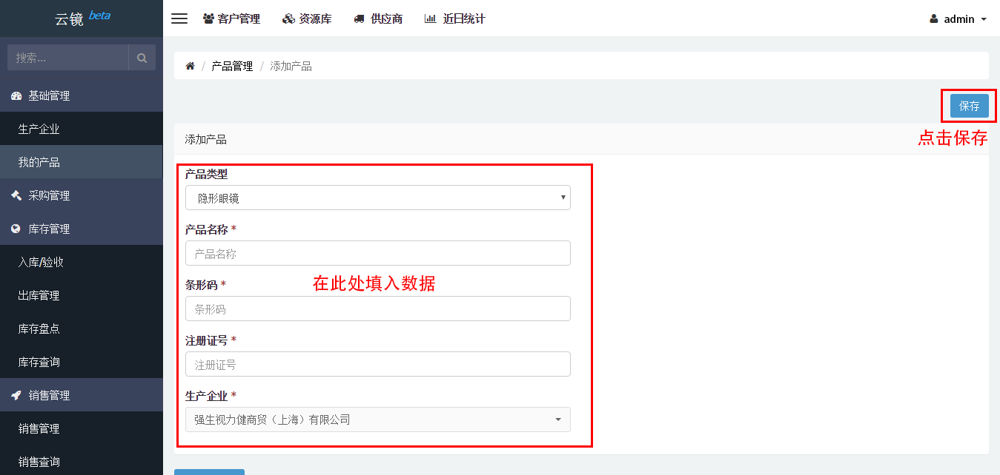
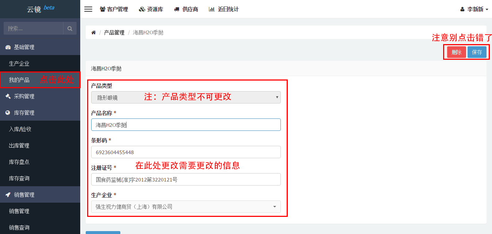
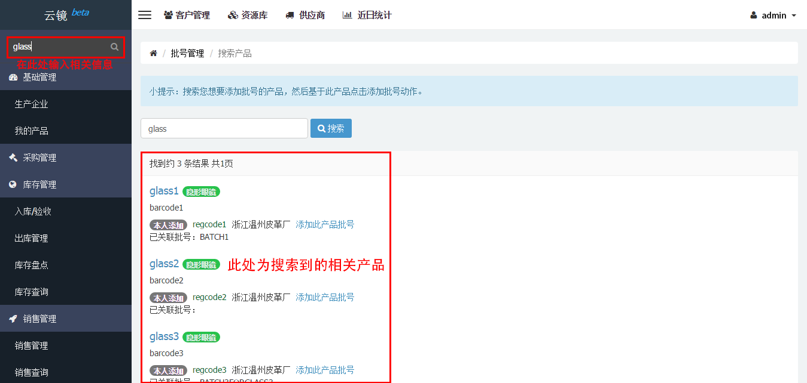
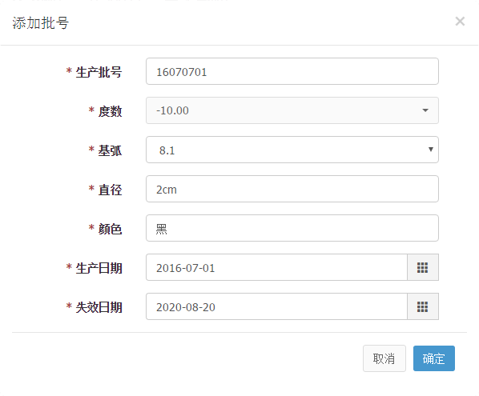
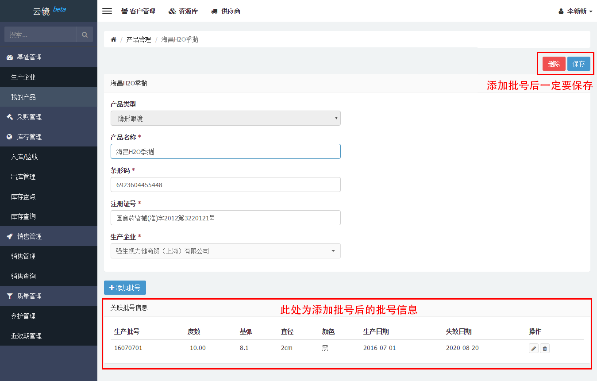

# 产品管理

## 添加产品
当新的产品进来，在[资源库](/extend/libproduct.html)也找不到时，可以按以下步骤进行添加。

- 点击左侧侧边栏[我的产品](https://58ee.top/product)。
- 找到右边内容区[添加产品](https://58ee.top/product/new)并点击。
  
- 输入__产品类型__、__产品名称__、__条形码__、__注册证号__及__生产企业__，点击保存完成添加。
  

## 编辑产品
当产品的相关信息需要更新或者删除时，可根据下列步骤进行修改。

- 点击左侧侧边栏我的产品。
- 在右侧内容区找到修改操作，根据行点击对应的修改链接。
- 进入新页面，在右侧内容区找到需要更改的输入框更改信息。
- 根据需要，点击保存或删除按钮。
  

## 查找产品
当产品的数量过多难以查找时，可根据下列步骤进行[产品查找](https://58ee.top/batch/search)。
> 方法1：

- 找到左侧侧边栏的搜索框。
- 输入大致的__产品名称__或__条形码号__甚至__注册证号__都可。
- 点击放大镜或者按下回车键即可。
  

> 方法2：

- 点击左边侧边栏我的产品。
- 找到右边内容框上方的搜索框。
- 下面的步骤同方法1。

## 添加批号
当有一批产品准备生产时，可以在产品页添加生产批号并进行关联，具体操作可根据下列步骤进行。

- 点击我的产品进入产品页面。
- 在需要批量生产的产品行中点击修改。
- 在产品详细信息下方找到添加批号按钮，并点击。
- 在弹出的模态框中输入__批号信息__，并点击确定。
  
- 确认信息无误后，点击右上方保存按钮，即可关联批号。
  
