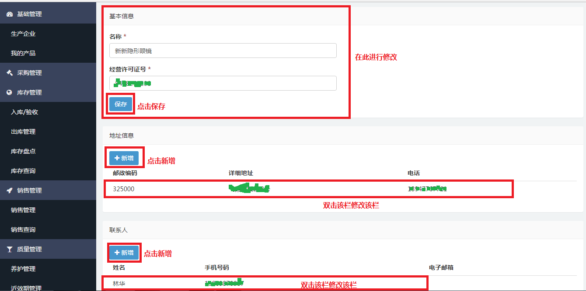

# 客户管理

## 添加客户
当需要添加客户时，可通过以下步骤添加客户

- 点击页面上方客户管理。
- 找到[客户列表](https://58ee.top/crm)并点击。
  
- 点击新建客户，选择添加**__个人用户__**或**__企业用户__**
  
- 如添加个人用户，则输入**__姓名__**、**__手机号码__**及**__邮箱__**（选填），点击保存完成添加。
  
- 如添加企业用户，则输入**__名称__**及**__经营许可证__**，点击保存完成添加。
  

## 编辑客户
当客户的相关信息需要更新或者删除时，可根据下列步骤进行修改。

- 点击上方客户管理，并点击客户列表。
  
- 在右侧内容区找到需要修改的客户，点击查看进入修改。
  
- 进入新页面，在右侧内容区找到需要更改的输入框更改信息。

  企业客户
  
  个人客户
  
  个人客户眼部信息修改
  

点击保存按钮完成编辑。

