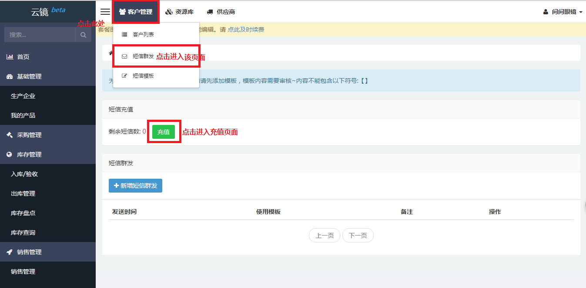
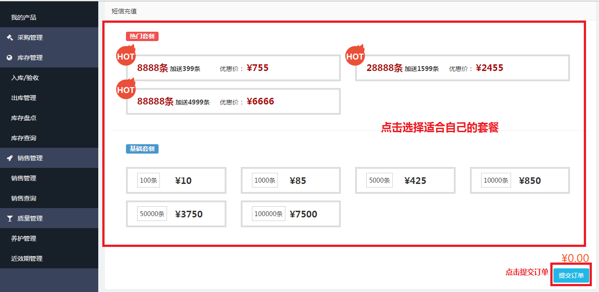
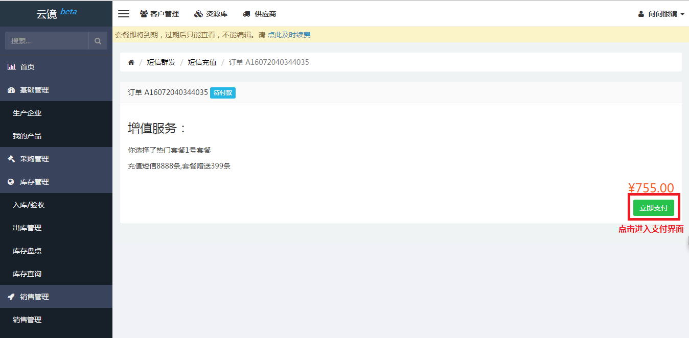
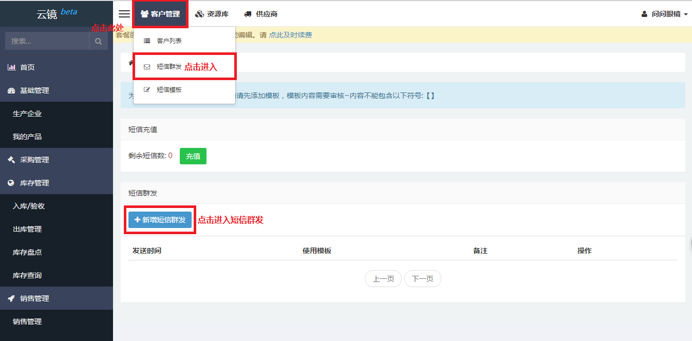
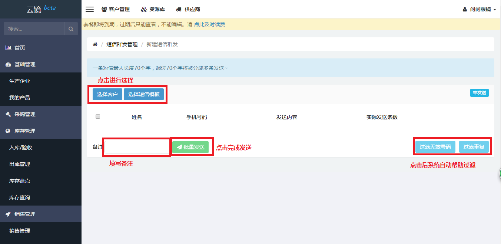
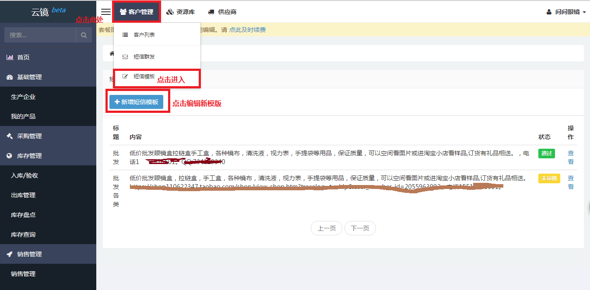
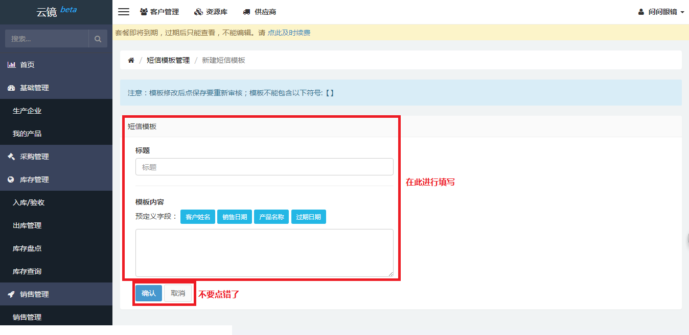
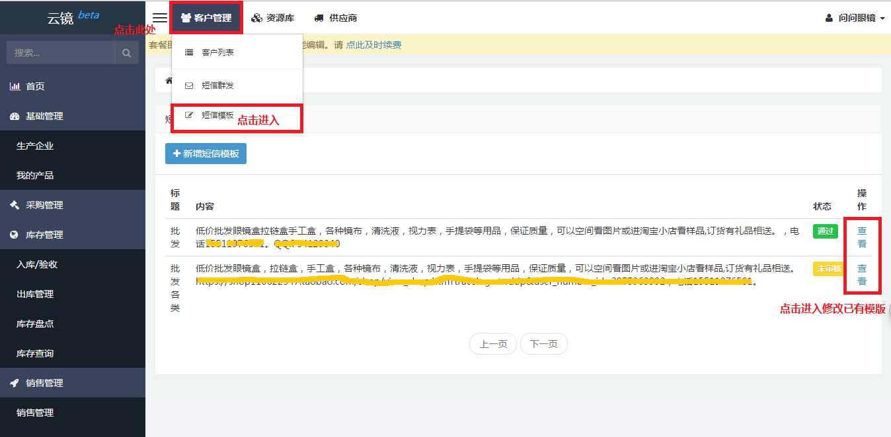
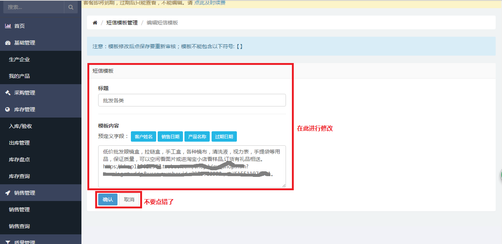

# 短信营销

## 短信充值
当需要进行短信充值时，可根据下列步骤进行充值。

- 点击上方客户管理，然后找到[短信群发](https://58ee.top/sms)并点击。
- 在右侧内容区找到充值按钮，点击进入[充值](https://58ee.top/pay/sms)界面。
  
- 进入新页面，在右侧内容区找到适合自己的套餐并点击。
- 点击右下方提交订单，进入新页面点击立即支付。
  
  
- 进入支付页面完成支付从而完成充值。（当前只支持支付宝支付）

## 短信群发
当需要进行短信群发时，可根据下列步骤进行短信群发。

- 点击上方客户管理，然后找到[短信群发](https://58ee.top/sms)并点击。
- 在右侧内容区找到新增短信群发按钮，点击进入编辑界面。
  
- 在新界面中对客户、短信模版进行选择，选填备注。
- 在确认完毕后，点击批量发送完成短信群发
  

## 短信模板
当需要编辑新的短信模版时，可根据下列步骤编辑新的短信模版。

- 点击上方客户管理，然后找到[短信模版](https://58ee.top/sms/tmpl)并点击。
- 在右侧内容区找到新增短信模版按钮，点击进入编辑新短信模版界面。
  
- 输入**__标题__**、**__模版内容__**,最后根据需要点击确认或取消。
  备注：短信模版完成后并不能直接进行发送，需要系统内部的管理员对其审核并通过后，才能发送。
  

当需要修改已有的短信模版时，可根据以下步骤修改短信模版。

- 在右侧内容区找到需要修改的短信模版，点击右侧的查看进入修改页面。
  
- 在需要的地方进行修改。
- 最后根据需要点击确认或取消。
  
