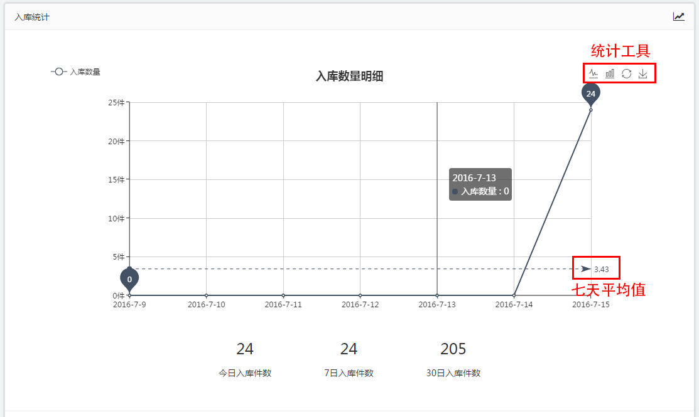

# 近日统计

[近日统计](https://58ee.top/dashboard)的作用是为了方便用户更清楚地了解近日来产品的入库、销售及客户的增长情况等。

## 查看统计信息
- 用户刚进入后台即可进入统计信息页面，也可以点击左侧侧边栏的首页进入
- 进入后可以发现统计信息页面共分为五大统计板块，分别是**__产品统计__**、**__近效期统计__**、**__入库统计__**、**__销售统计__**和**__客户统计__**，用户可根据需求自主查看信息。

## 统计工具的使用 
* 图表右上方的一行工具框作用分别为：**__转换为折线图__**、**__转换为柱状图__**、**__还原__**及**__下载图表__**
* 图表中的虚线为七天中的数据平均值
* 鼠标放入图表中可以查看具体日期的数据
 
