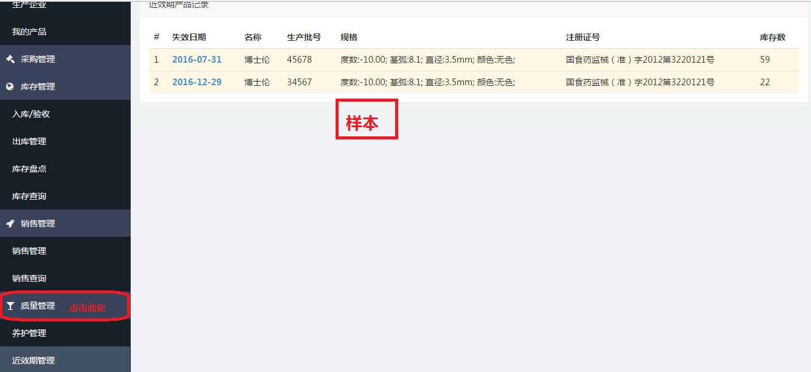
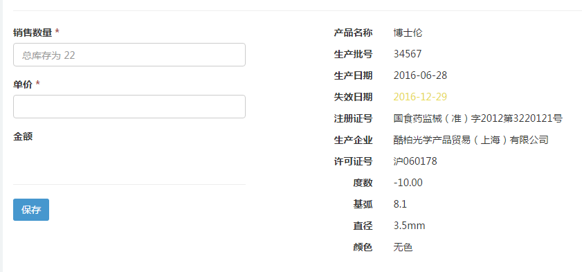
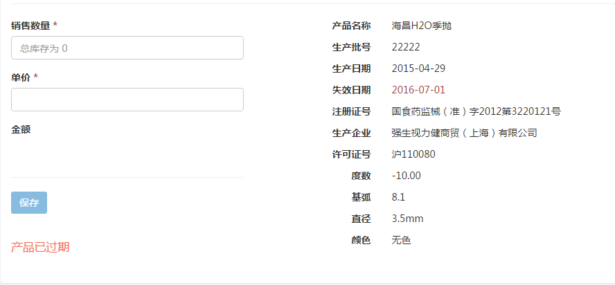

# 近效期管理

## 查看近效期
如有查看近效期的需求，可按下列步骤进行操作。

- 找到左侧边栏[近效期管理](https://58ee.top/expire)并点击进入。
- 在右侧内容区查看近效期情况。只有6个月内将失效或者已过期的产品才会显示在该栏目中，并分别以黄色和红色区分。
  

## 近效期锁定
近效期管理还有销售自动锁定功能。在销售产品的时候，对6个月内将要过期的产品进行黄色字体提示。

已过期的产品红色提示并无法对其进行销售。

