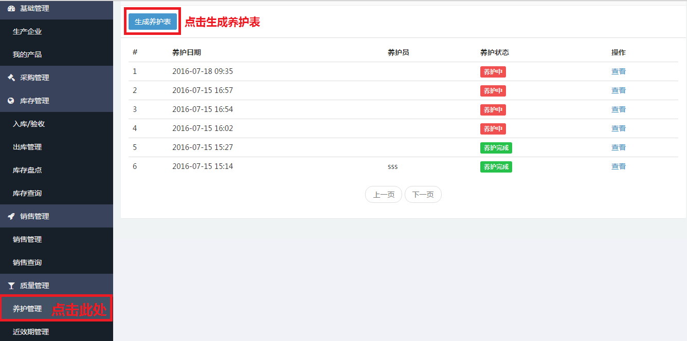
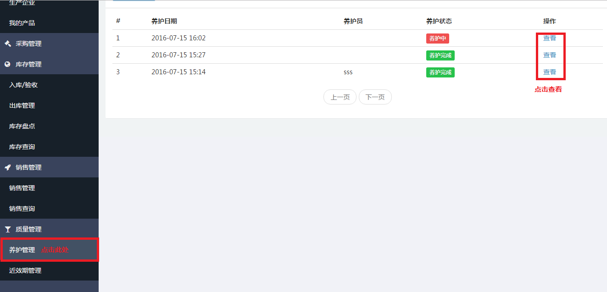
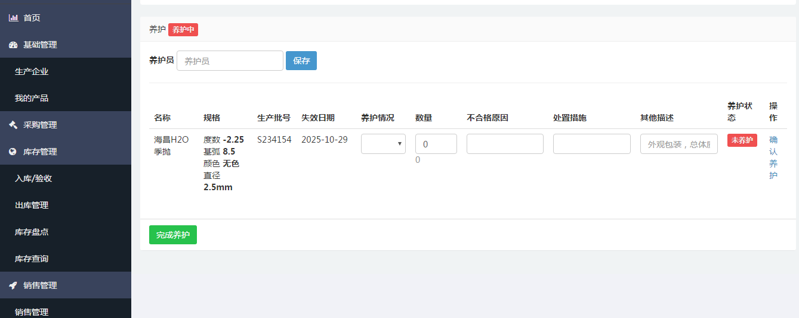
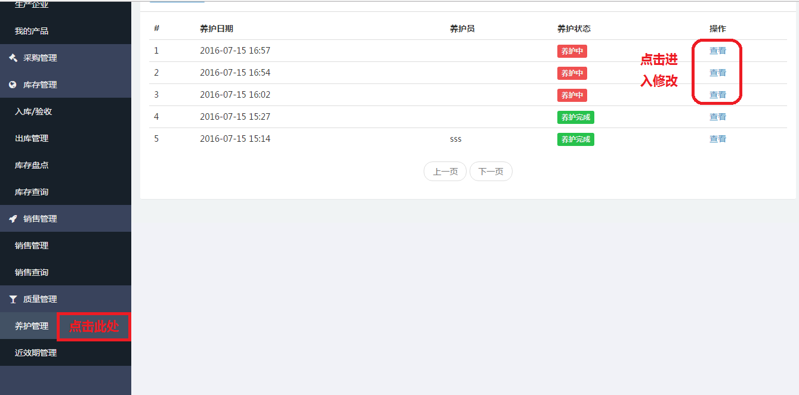
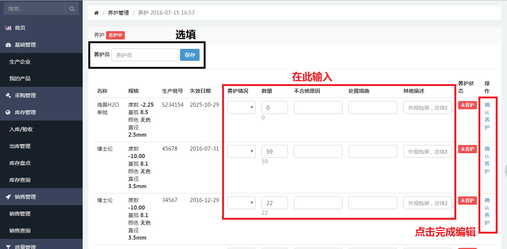

# 养护管理

## 生成养护表
当时需要生成养护表时，可根据下列步骤生成养护表。

- 点击左侧侧边栏[养护管理](https://58ee.top/maintenance)。
- 在右侧内容区找到**__生成养护表__**，点击，即生成养护表。
  

## 查看养护
当需要查看养护情况时，可根据下列步骤进行查看。

- 点击左侧侧边栏[养护管理](https://58ee.top/maintenance)。
- 在右侧内容区找到要查看的项目，点击查看
  
  

## 编辑养护
当有一批新产品入库后需要养护时，用户可按下列步骤进行操作，方便清晰地掌握产品养护情况。

- 在左侧侧边栏的入库管理中找到[养护管理](https://58ee.top/maintenance)并点击。
- 在右侧内容区找到需要编辑的养护项，点击**__查看__**进入编辑页面
- 进入后可对需要养护的产品编辑**__养护情况__**、**__数量__**、**__不合格原因__**、**__处置措施__**及**__其他描述__**。
- 点击确认养护完成编辑
  
  

