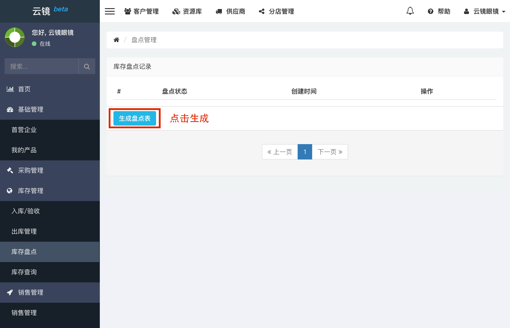
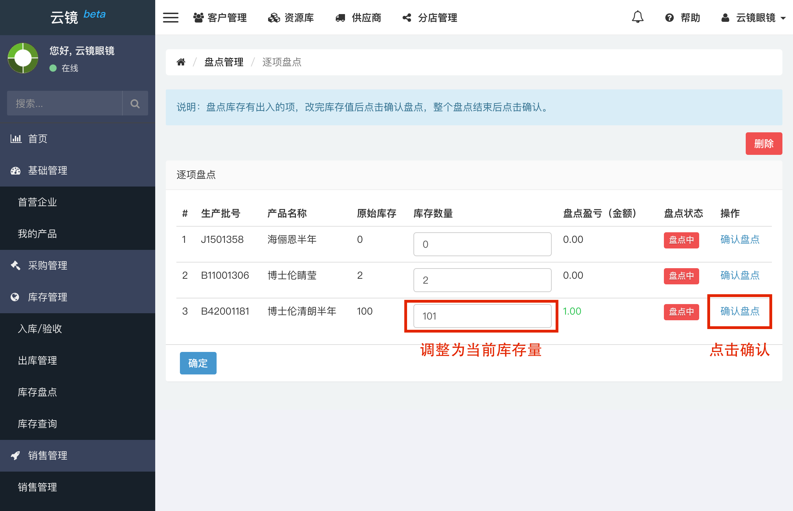
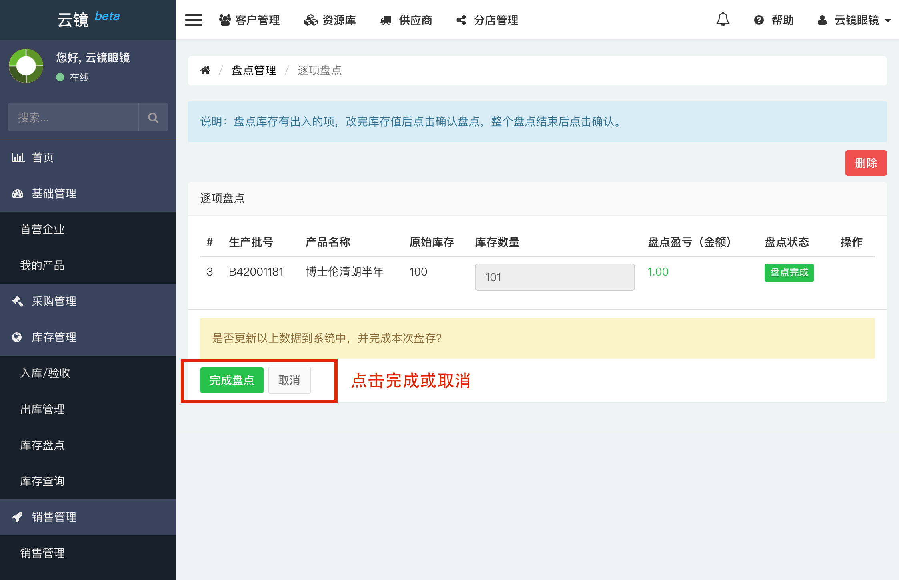
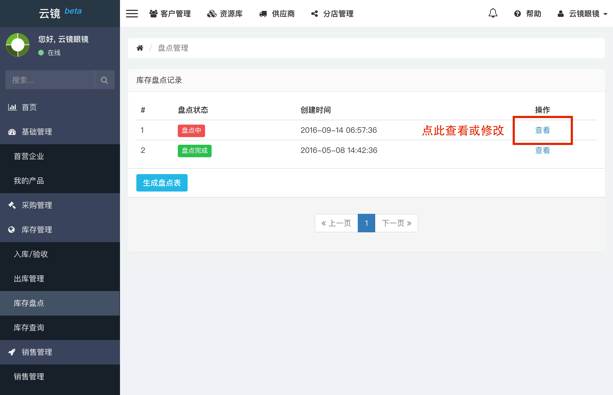
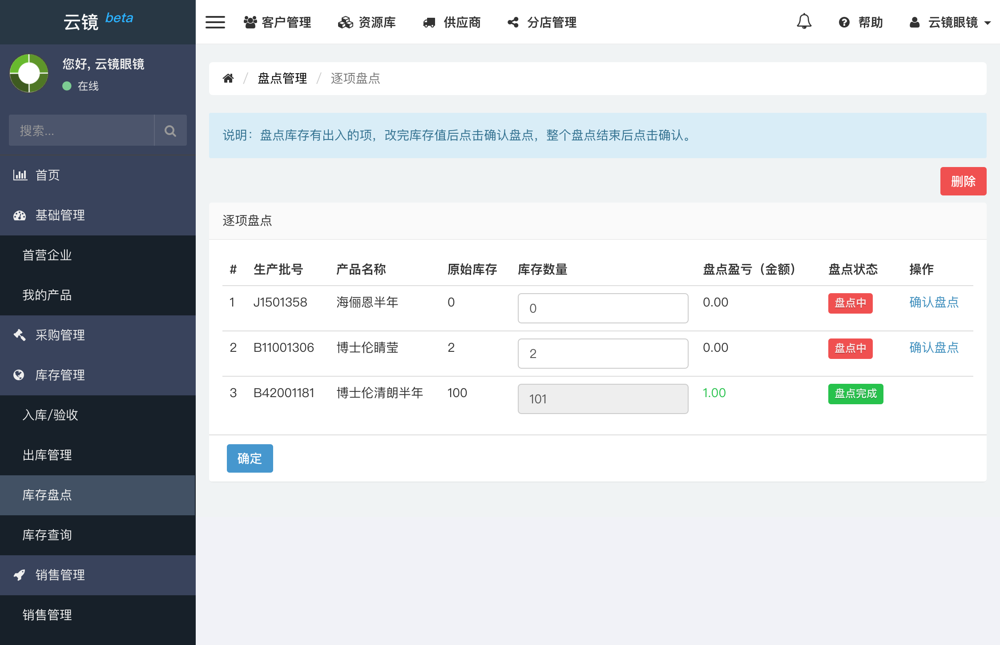
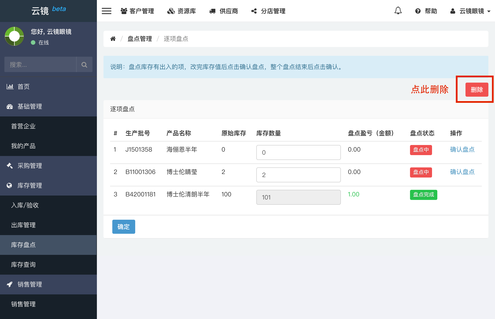
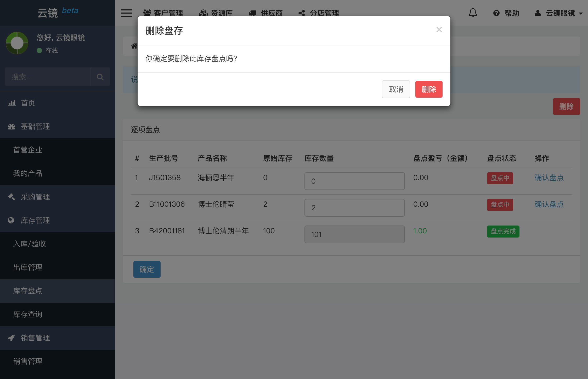

# 库存盘点
库存盘点建议一次性完成，因为盘点时理论上不能进行买卖，防止库存出现问题。

## 新增盘存
为了更好地掌握店里库存情况，用户应该一定时间对库存进行盘点，以防出入。盘点库存时，用户可按下列步骤进行操作。

- 在左侧侧边栏的库存管理中找到[库存盘点](https://58ee.top/stockcheck)并点击进入。
- 点击右侧内容区**生成盘点表**按钮。
  
- 进入后可对当前库存中的产品数量进行修改，对有出入的库存量进行盘点。若不能一次性盘点完可以下次继续盘点，系统会保留本次盘存已进行部分的记录，下次只需要直接点击查看即可进行编辑。
  
- 库存盘点完成后可点击**确定**完成盘存，点击**确定**后，系统会进行二次确认，如图，只有点击**完成盘点**后才会更新库存数据库。
  
- 这样就完成了一次库存盘点。

## 编辑盘存
当之前生成的盘点表尚未完成时，可以按照以下步骤继续进行盘存操作。

- 找到左侧边栏[库存盘点](https://58ee.top/stockcheck)并点击进入。
- 找到需要编辑的盘存记录，如图点击**查看**。
  
- 如图同样按照上面的盘存过程继续做盘存操作。
  

## 删除盘存
当您需要删除未完成盘点的盘存记录时，可以按照以下步骤进行操作。已完成盘点的记录不能删除。

- 找到左侧边栏[库存盘点](https://58ee.top/stockcheck)并点击进入。
- 在右侧找到**删除**按钮并点击。
  
- 删除时会提示进行二次确认，以防误删除。确认删除后此盘存记录才会真正从数据库删除。
  

