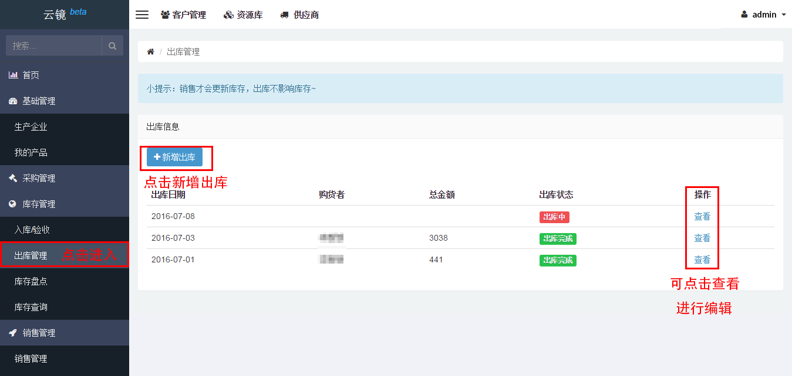
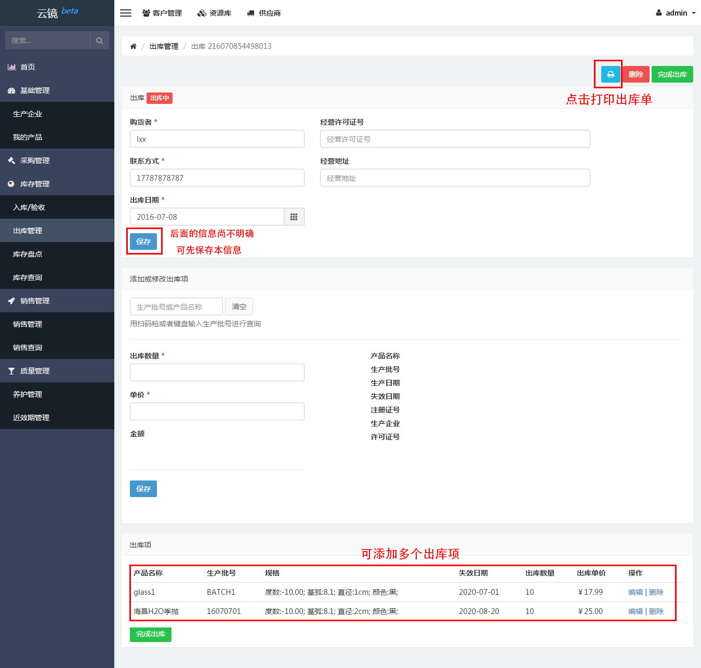
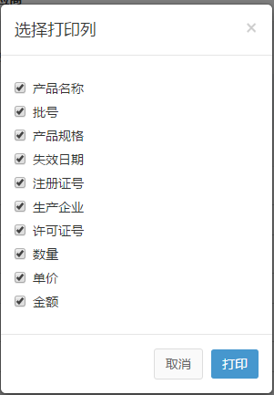

# 出库管理

## 新增出库/编辑出库 
当有一批产品完成销售或者需要出库时，用户可按下列步骤进行操作，方便清晰地掌握产品出库情况。

- 点击左侧侧边栏[出库管理](https://58ee.top/stockout)并点击进入
- 点击右侧内容区**__新增出库__**按钮。
- 进入后可对信息进行填写，若部分信息不能立刻填写完成，**__可以先保存__**，如下图保存后状态为出库中，下次需要添加或者修改信息直接点击查看即可进行编辑。
  
- 出库信息都确定输入完整并正确后点击完成出库，完成操作。
  

**小提示：**
  - 一次出库可以添加多个出库项。
  - **销售才会更新库存，出库不影响库存**。

## 打印出库单 
如有打印出库单的需求，可按下列步骤进行操作。
  
- 找到左侧侧边栏[出库管理](https://58ee.top/stockout)并点击进入。
- 在右侧内容区找到需要打印出库单的地方点击查看。
- 点击打印按钮，选择需要打印的信息。
  
- 使用打印机完成打印。

