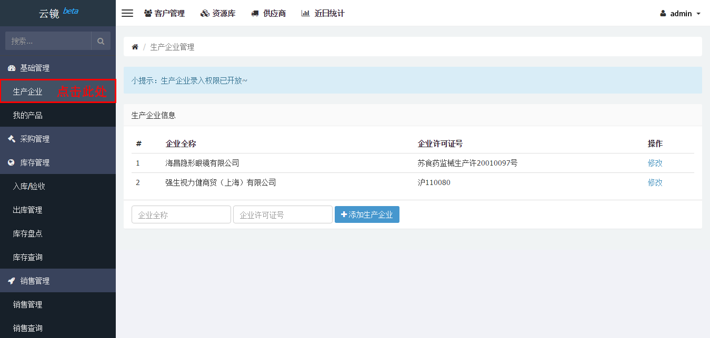
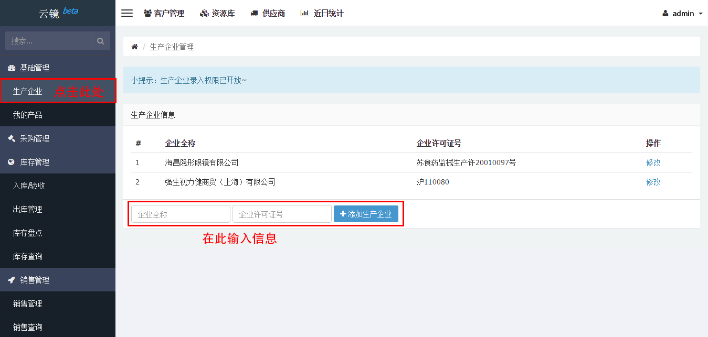
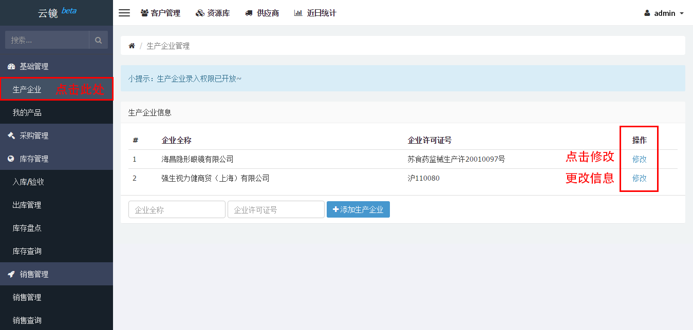
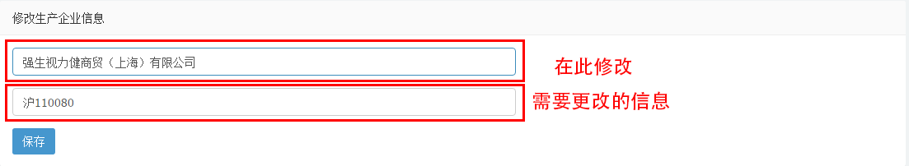

# 首营企业管理

## 查看企业信息
点击左侧边栏[首营企业](https://58ee.top/factory)即可查看。

**注**：第一次进入尚未添加企业时，首营企业为空。

## 添加企业信息
点击左侧边栏[首营企业](https://58ee.top/factory)。

在右侧内容区中找到输入框，输入**企业全称**及**许可证号**。

点击添加首营企业按钮，完成添加首营企业。

## 编辑企业信息
当首营企业名称或者许可证号更改时，可根据下列步骤进行修改。

- 点击左侧边栏[首营企业](https://58ee.top/factory)
- 在右侧内容区找到**修改操作**，根据行点击对应的修改链接。
  
- 在右侧内容区找到需要更改的输入框更改信息。
  

