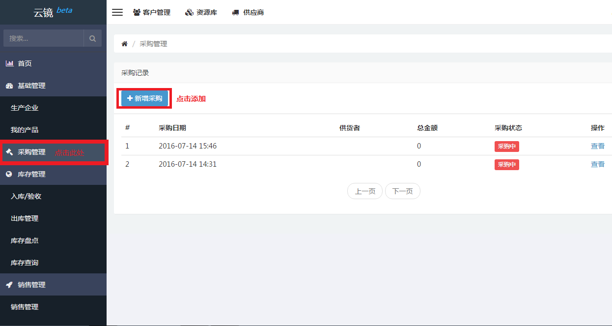
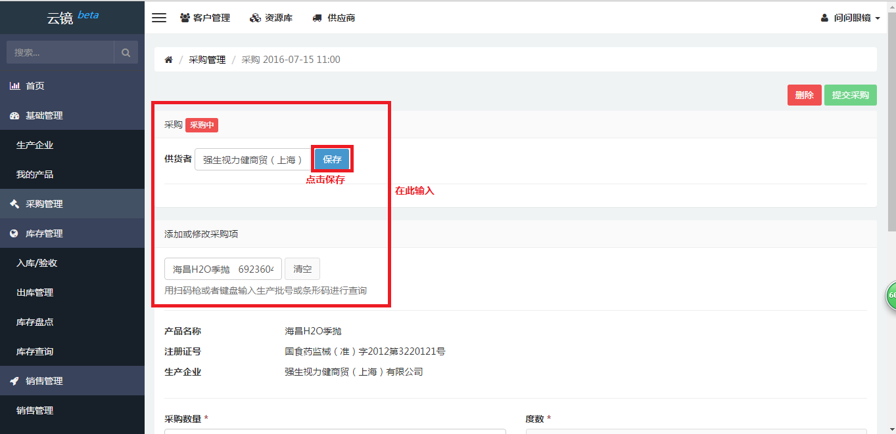
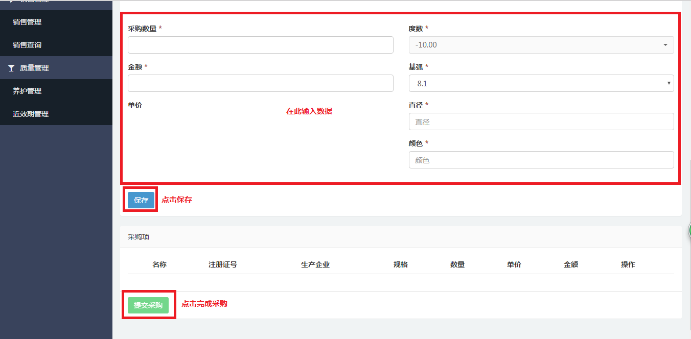
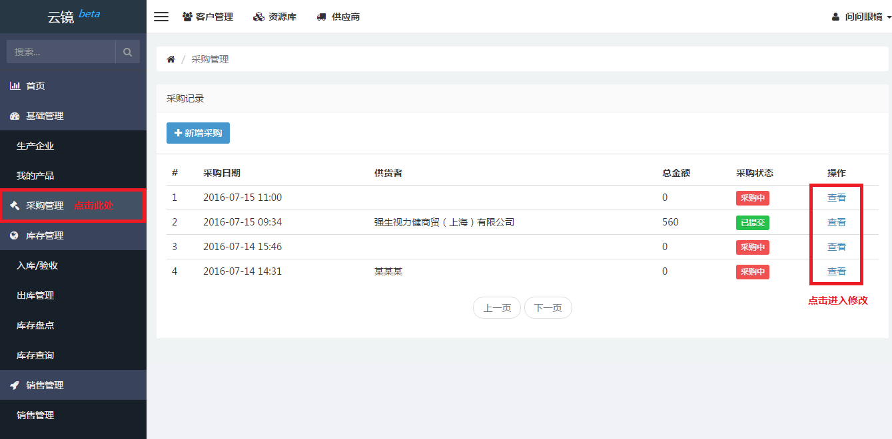
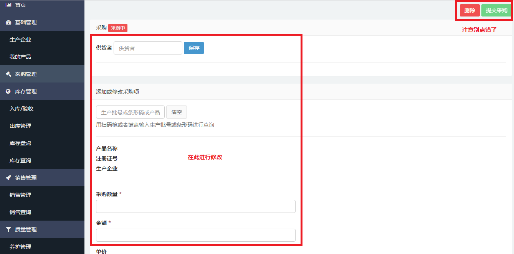

# 采购管理

[采购管理](https://58ee.top/buying)作为单一管理模块，为用户提供全方位的采购计划管理。
对于有生产批号的产品，用户在采购产品的时候是不知道其生产批号的，所以采购时无须关心批号，只需填写产品特征属性。

## 新增采购
当用户需要购入产品时，用户可按下列步骤进行操作，方便清晰地掌握采购情况。

- 点击左侧侧边栏[采购管理](https://58ee.top/buying)。
- 找到右边内容区新增采购并点击。
  
- 输入__供货者__、__生产批号或条形码__、__采购数量__、__金额__、__度数__、__基弧__、__直径__及__颜色__点击保存。再点击左下方的提交采购完成添加。
  
  

## 编辑采购
当产品的相关信息需要更新或者删除时，可根据下列步骤进行修改。

- 点击左侧侧边栏[采购管理](https://58ee.top/buying)。
- 在右侧内容区找到需要编辑的采购，点击查看，可进入编辑界面。
- 进入新页面，在右侧内容区找到需要更改的输入框更改信息。
- 根据需要，点击保存或删除按钮。（备注：已提交的采购不能编辑，但可以撤销；撤销后可编辑)
  
  

