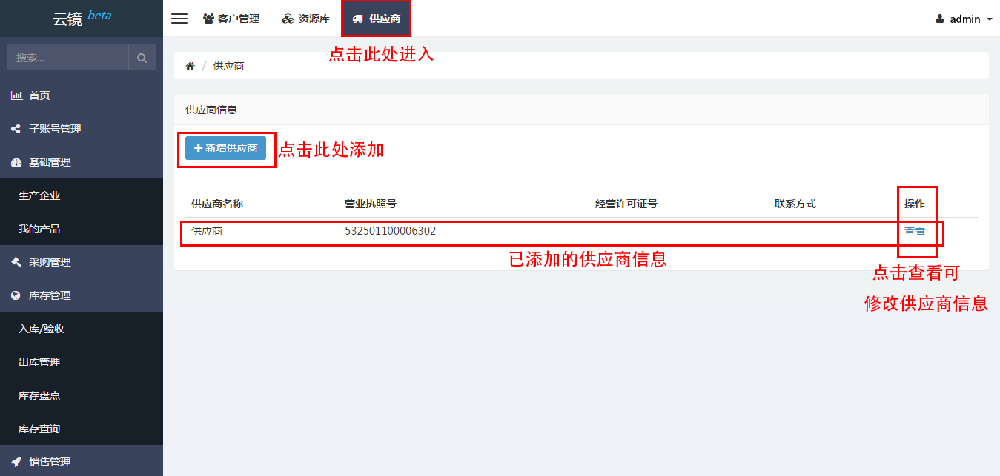

# 供应商

## 添加供应商
- 从网站头部导航栏中找到[供应商](https://58ee.top/provider)并点击进入
- 在内容区中找到新增供应商并点击
  
- 在新页面中填入**__名称__**、**__营业执照号__**、**__经营许可证号__**、**__地址__**、**__联系方式__**和**__联系人__**。
  

**注：**其中**__名称__**和**__营业执照号__**是必填信息

## 编辑供应商
- 找到需要更改信息的供应商
- 点击查看，可进入修改界面
- 修改完成后，点击保存即可
  

