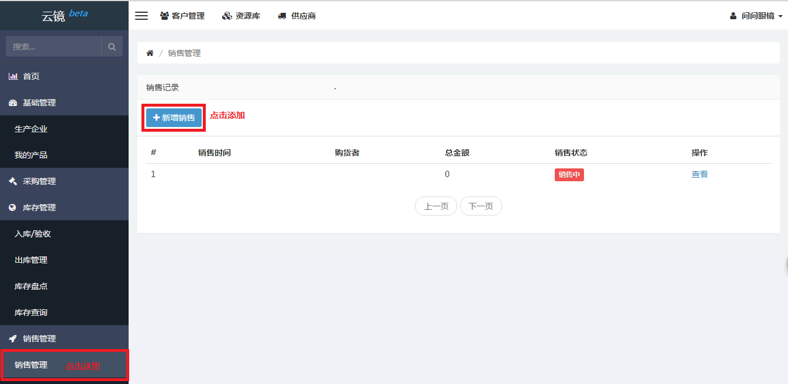
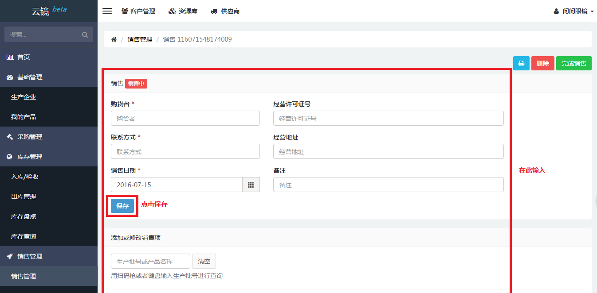
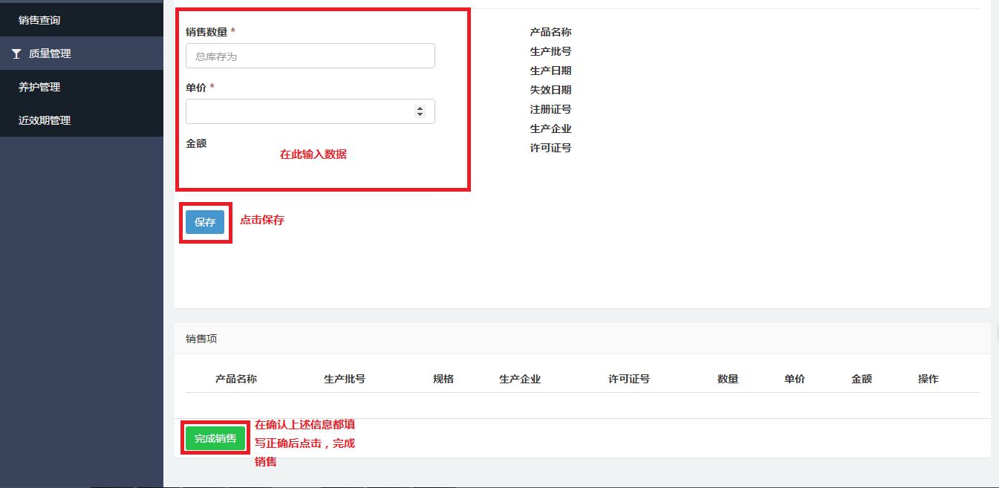
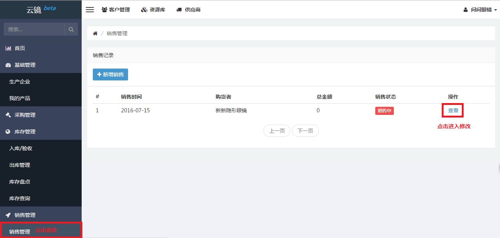
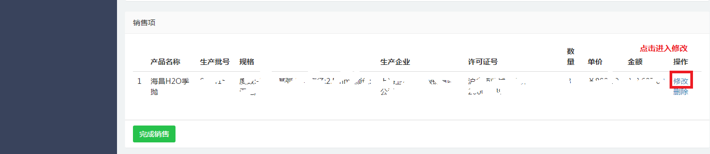
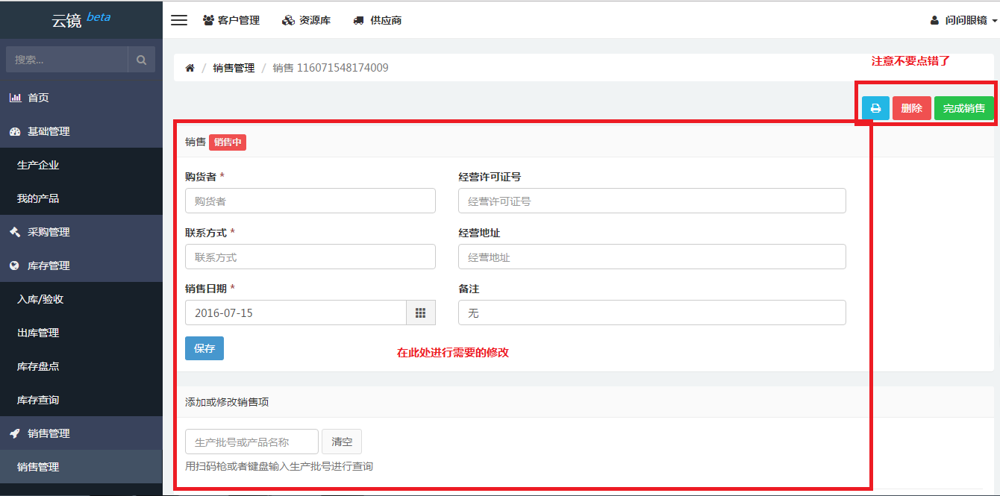
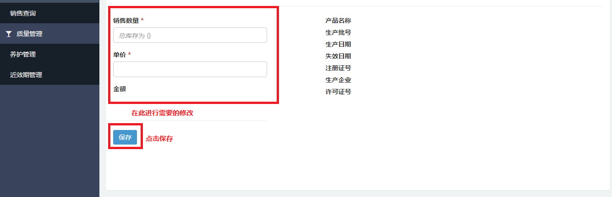
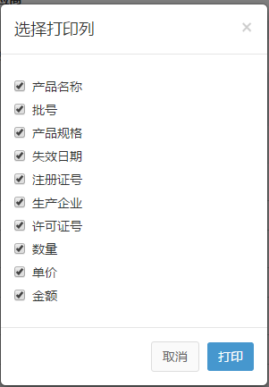

# 销售管理

## 新增销售

- 点击左侧侧边栏[销售管理](https://58ee.top/selling)。
- 找到右边内容区新增销售并点击。
  
- 输入**__购货者__**、**__联系方式__**、**__销售日期__**、**__经营许可证号__**、**__经营地址__**、**__备注__**、**__生产编号或产品名称__**、**__销售数量__**及**__单价__**，点击保存。
- 在确认上述信息都填写正确后，点击左下方的完成销售，完成销售
  
  

## 编辑销售 
当某次未完成的销售的相关信息需要更新或者删除时，可根据下列步骤进行修改。

- 点击左侧侧边栏[销售管理](https://58ee.top/selling)。
- 在右侧内容区找到需要修改的销售项，点击查看，可进入修改界面
  
- 进入新页面，先在页面最下方找到修改并点击，进入修改
- 在右侧内容区找到需要更改的输入框更改信息。
- 根据需要，点击保存或删除按钮。
  
  
  

## 打印销售单 
如有打印销售单的需求，可按下列步骤进行操作。

- 找到左侧侧边栏[销售管理](https://58ee.top/selling)并点击进入。
- 在右侧内容区找到需要打印销售单的项目点击查看。
- 点击打印按钮，选择需要打印的信息。
  
- 使用打印机完成打印。

