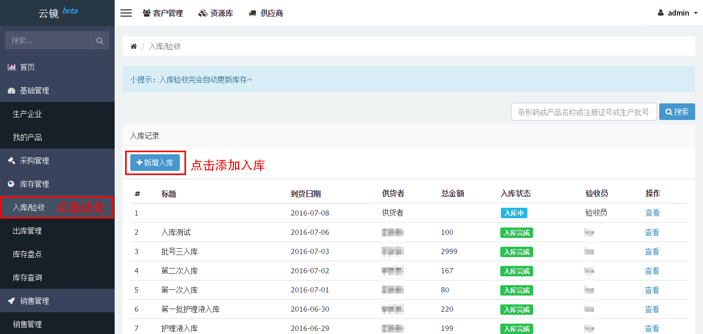
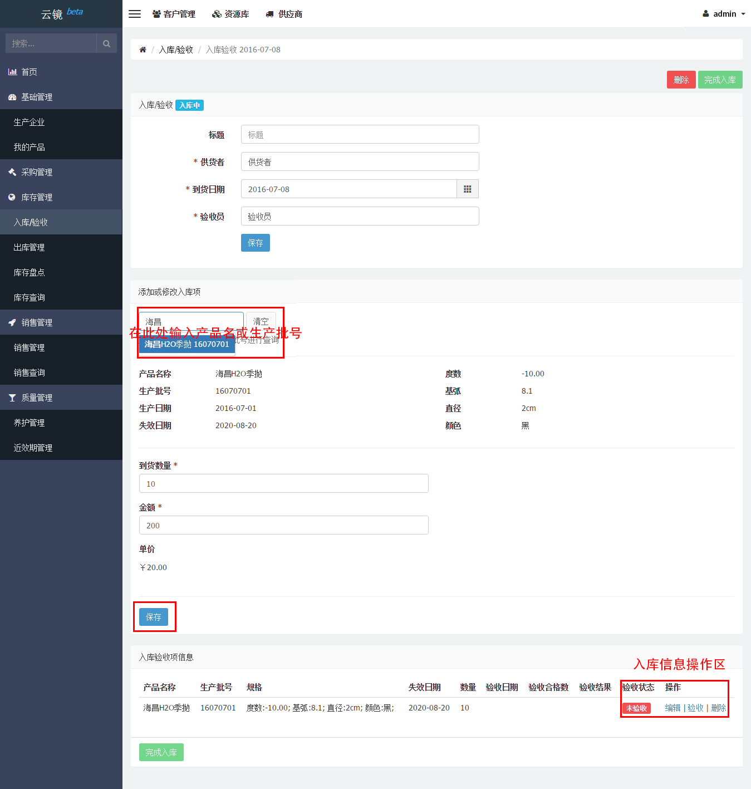
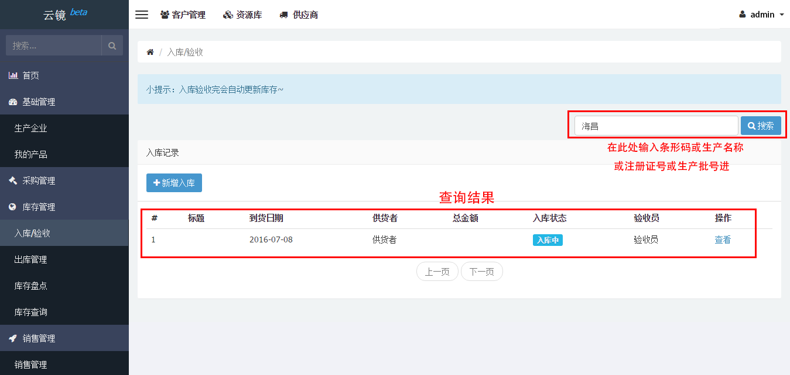

# 入库管理

## 新增入库/编辑入库
当有一批新产品入库时，用户可按下列步骤进行操作，方便清晰地掌握产品入库情况。

- 在左侧侧边栏的库存管理中找到[入库/验收](https://58ee.top/stockin)并点击。
- 点击右侧内容区__新增入库__按钮。
- 进入后可对信息进行填写，若部分信息不能立刻填写完成，**可以先保存**，如下图保存后状态为入库中，下次需要添加或者修改信息直接点击查看即可进行编辑。
  
- 产品入库完成后可点击验收记录产品的验收状态，输入必填的__验收时间__和__验收合格数__，点击确认验收即可。
- 入库信息都确定输入完整并正确后点击完成入库，完成操作。
  

**小提示：**
  - 入库验收完系统会自动更新库存。
  - 一次入库可以添加多个入库验收项。
  - 若有验收不合格的产品，可在操作中选择退货。
    

## 入库查询
当您需要查询相关产品或者该生产批号的详细入库信息，可以按照以下步骤进行操作。

- 找到左侧边栏[入库/验收](https://58ee.top/stockin)并点击进入
- 在右侧找到搜索框输入__条形码__或__产品名称__或__注册证号__或__生产批号__进行查询，将得到下图结果。
  

**注：** 搜素结果可为多个

